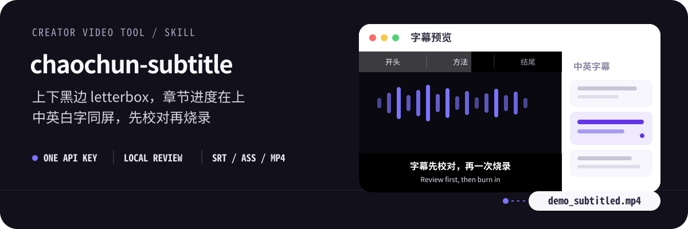
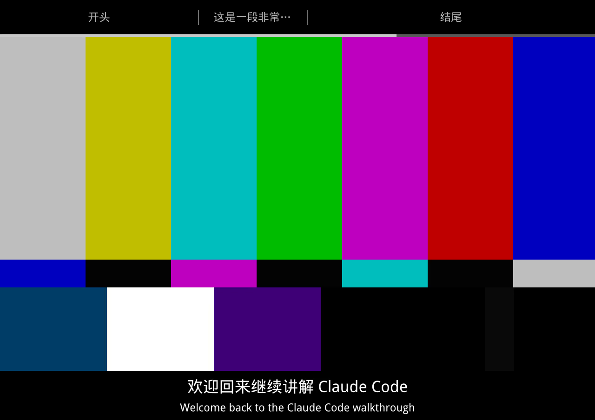
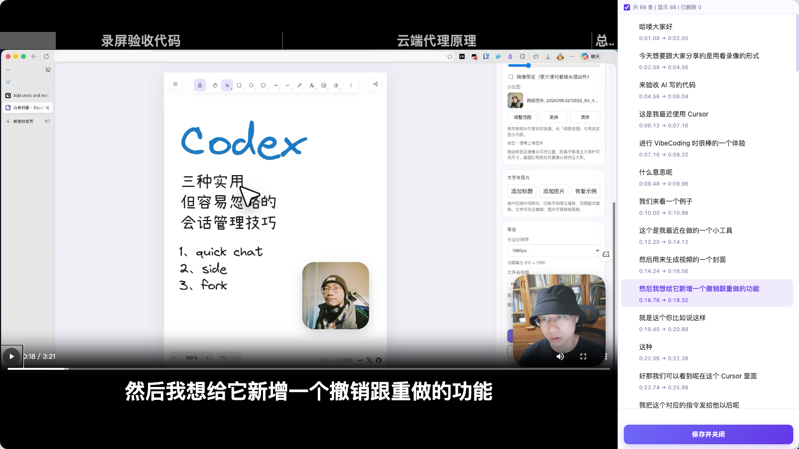

# chaochun-subtitle

<p align="center">
  
</p>

**chaochun-subtitle** 是开源 skill [oil-subtitle](https://github.com/oil-oil/oil-subtitle) 的派生拓展，不是从零重写。上游由 [oil-oil](https://github.com/oil-oil) 及贡献者完成 ASR、术语纠错、人工预览、章节和 FFmpeg 烧录；本仓在此基础上改默认成片观感，面向需要上下黑边、章节进度条和中英同屏烧录的成片。

上游仓库的 GitHub `license` 字段目前为空。本 fork 仍明确致谢原作者与上游版权，详见 [NOTICE](NOTICE) 与下方「上游致谢」。

把已经导出的 MP4、MOV 交给 Agent，依次完成转录、术语纠错、人工预览、章节生成和 FFmpeg 烧录。默认烧录 **letterbox 双语成片**：原画面居中，上下加黑边；**上方**是上游原来在画面底部的那种**章节进度条**（横向分区 + 浅灰进度随播放推进，标签比上游默认更大），**下方中英白字同屏**（中文在上、英文在下）。只需要一个百炼 API Key。

也可以只导出英文 SRT（与上游「英文 SRT 分支」相同）：保留原时间轴，不启动预览、不生成章节、不烧录视频。

[快速开始](#快速开始) · [与上游的差异](#与上游-oil-subtitle-的差异) · [工作流程](#工作流程) · [维护词库](#维护-hotwords-与-glossary) · [数据边界](#数据边界)

## 上游致谢

本项目派生自：

- 仓库：[oil-oil/oil-subtitle](https://github.com/oil-oil/oil-subtitle)
- 作者：oil-oil 及上游贡献者
- 用途：本地视频中文转录、校对、预览与烧录

请在再分发或二次修改时保留上游链接与作者署名。上游未提供 SPDX license 字段，不代表可以省略 attribution。

## 与上游 oil-subtitle 的差异

| | 上游 oil-subtitle | 本 fork（chaochun-subtitle） |
| --- | --- | --- |
| 成片画布 | 字幕叠在原始画面内，底部 MarginV + 半透明底 | 上下黑边 letterbox，中间保留原画 |
| 章节进度 | 画面底部半透明渐变条，标签约 22px（1080p） | 整条迁到上方黑边；浅灰加大；短区段长标题用省略号单行截断 |
| 字幕 | 默认只烧中文白字 | 默认中英同屏白字，中文在上、英文在下 |
| 英文 | 单独的「英文 SRT 分支」，不进入默认烧录 | 沿用该翻译分支接到 ASS/烧录；`--no-bilingual` 可退回只烧中文 |
| 折行 | 偏保守的每行字数，容易一条变两行 | 按黑边宽度尽量单行；中英各自尽量不折行 |

无法避免折行的情况：单条含超长专有名词、或英文翻译显著长于中文时，仍会按标点/词界折行，并在 SKILL 中说明这一权衡。

## 效果预览

<p align="center">
  
</p>

<p align="center">
  
</p>

人工预览编辑器左侧实时预览字幕（布局贴近成片：上章节进度、下字幕），右侧逐句修改、删除或批量查找替换，确认后点击「保存并关闭」即可继续烧录。中文与英文或数字之间默认补一个半角空格，预览、SRT/ASS 和最终成片使用同一规则。

保存时会自动比较人工修改并生成待审报告，但不会调用模型或自动写入个人错题本。Agent 只把稳定、安全且不冲突的 ASR 映射写入词库；润色、删句和标点修改不会污染词库。

## 最终会得到什么

一次完整处理会保留可追溯的中间结果，并交付可继续修改的字幕文件和成片：

```text
demo.subtitle-work/
├── bailian_asr.json             # 原始 ASR 响应
├── transcript.json              # ASR、术语校正并分行后的转录稿
├── reviewed-transcript.json     # 等待 Agent 校对的转录稿副本
├── subtitle-review.json         # 技术词聚焦清单与校对模式记录
├── review-frames/               # Agent 按需抽取的验证帧
├── subtitle-transcript.json     # 人工预览后保存的字幕
├── manual-edit-review.json      # 人工修改的待审与忽略记录
├── subtitle-chapters.json       # 长视频章节
└── subtitle-manifest.json       # 本地预览入口

demo_subtitled.srt
demo_subtitled.ass
demo_subtitled_en.srt            # 与中文时间轴对齐的英文 SRT
demo_subtitled.mp4
```

## 工作流程

1. 用 FFmpeg 从本地视频提取单声道音频。
2. 通过 DashScope Python SDK 调用百炼 FunAudio ASR，保留原始识别结果和词级时间戳。
3. 在识别阶段应用 hotwords，再用 glossary 修正常见误识别。
4. 脚本原样复制转录稿并生成技术词聚焦清单；Agent 通读全部字幕，结合上下文、音频和必要画面修正错词。百炼模型不自动修改字幕正文。
5. 用 Qwen 完成字幕级断句；章节进度默认开启，视频严格超过 3 分钟时生成 2–6 个宽粒度章节，并在**上方黑边**展示横向分区进度条，不压原画和字幕。区段太窄、标题太长时用省略号截断为单行。
6. 启动本地字幕编辑器，由用户检查 Agent 校对结果，并按需修改或删除字幕。
7. 保存时自动提取人工修改并生成待审报告；Agent 判断是否需要显式加入个人 glossary，脚本不会自动写入。
8. 生成中文 SRT、英文 SRT、ASS，并用 FFmpeg **pad 上下黑边**后一次烧录成片。烧录前若还没有英文，则按上游英文翻译规则逐条译出并写入 ASS。

正常烧录还会检测持续出现的人脸区域并执行固定轻度美颜；需要保留原画时使用 `--no-beauty`。

## 快速开始

运行环境：macOS、Python 3、Homebrew。`setup.sh` 会准备独立虚拟环境，并在缺少 FFmpeg 时通过 Homebrew 安装。Linux 可直接使用已有的 Python / FFmpeg 跑烧录与单测（美颜人脸检测仍依赖 macOS Vision）。

```bash
SKILL_DIR="/absolute/path/to/chaochun-subtitle"

bash "$SKILL_DIR/setup.sh"
"$SKILL_DIR/.venv/bin/python3" \
  "$SKILL_DIR/scripts/configure_api_key.py"
```

配置完成后，把视频路径和目标告诉 Agent：

```text
给 /path/to/demo.mp4 加字幕，先让我校对，再烧录成片。
```

默认即 letterbox + 中英同屏。只要中文、或只要英文字幕文件时，直接说明即可。Agent 的完整执行规范见 [SKILL.md](SKILL.md)。

不想显示章节进度条时，直接告诉 Agent“这次关闭章节进度条”即可；Agent 会跳过章节生成并在烧录时关闭进度条，不需要手动修改配置。需要重新开启时说“开启章节进度条”。

## API Key 只需配置一次

FunAudio ASR、Qwen 字幕断句、章节生成、英文翻译和 hotwords 共用同一个百炼 API Key，全部通过 DashScope Python SDK 调用，不需要安装百炼 CLI、Node.js，也不依赖 ZenMux。

为兼容上游，默认保存位置仍为：

```text
~/.config/oil-subtitle/dashscope_api_key
```

文件权限固定为 `600`。后续运行会自动读取，无需重复输入。读取优先级为：

1. 当前环境中的 `DASHSCOPE_API_KEY`；
2. 本地 API Key 文件；
3. 旧的 `~/.bailian/config.json`。

如果以前执行过 `bl auth login`，`setup.sh` 会尝试把旧凭据迁移到新位置。

## 维护 hotwords 与 glossary

词库全部使用普通 JSON 文件，放在用户自己的配置目录，不必修改 Skill 代码，也不要把个人词库或 API Key 提交进仓库。个人 glossary 默认保存在 `~/.config/oil-subtitle/glossary.json`；只有希望换位置时才需要在配置中填写 `glossary`。

`hotwords.json` 在 ASR 识别阶段提高产品名、英文缩写和人名的命中率：

```json
[
  { "text": "Claude Code", "weight": 4, "lang": "en" },
  { "text": "百炼", "weight": 4, "lang": "zh" }
]
```

`glossary.json` 在识别完成后执行确定性替换，适合修正已经反复出现的错字：

```json
[
  { "wrong": "Claude Core", "correct": "Claude Code" },
  { "wrong": "白练", "correct": "百炼" }
]
```

在 `~/.config/oil-subtitle/config.json` 中指向这两个文件：

```json
{
  "hotwords": "~/.config/oil-subtitle/hotwords.json",
  "glossary": "~/.config/oil-subtitle/glossary.json",
  "subtitles": {
    "progress_enabled": true,
    "progress_min_duration_seconds": 180
  }
}
```

预览页保存后，脚本会固定比较修改前后的字幕，把可能复用的错词映射记录到 `manual-edit-review.json` 的 `pending`，但不会调用模型或自动追加 glossary。Agent 只在映射来自原句连续子串、保留必要上下文且不与已有规则冲突时显式写入；一次性改写、删句和标点调整保持忽略。hotwords 内容变化后，脚本会自动更新远程词表缓存。

## 手动运行

如果不通过 Agent，也可以直接执行各阶段脚本。下面是主流程中的核心命令：

```bash
SKILL_DIR="/absolute/path/to/chaochun-subtitle"
VIDEO="/path/to/demo.mp4"
WORK="/path/to/demo.subtitle-work"
mkdir -p "$WORK"

"$SKILL_DIR/.venv/bin/python3" "$SKILL_DIR/scripts/bailian_transcribe.py" \
  "$VIDEO" \
  --output "$WORK/transcript.json" \
  --raw-output "$WORK/bailian_asr.json" \
  --language zh

"$SKILL_DIR/.venv/bin/python3" "$SKILL_DIR/scripts/review_subtitles.py" \
  --video "$VIDEO" \
  --transcript "$WORK/transcript.json" \
  --output "$WORK/reviewed-transcript.json" \
  --report "$WORK/subtitle-review.json" \
  --frames-dir "$WORK/review-frames"

"$SKILL_DIR/.venv/bin/python3" "$SKILL_DIR/scripts/prepare_subtitles.py" \
  --transcript "$WORK/reviewed-transcript.json" \
  --video "$VIDEO" \
  --output "$WORK/subtitle-transcript.json" \
  --chapters-output "$WORK/subtitle-chapters.json" \
  --manifest-output "$WORK/subtitle-manifest.json" \
  --work-dir "$WORK/cache" \
  --resume
```

烧录默认双语 letterbox（无现成英文时会调用 Qwen 翻译）：

```bash
"$SKILL_DIR/.venv/bin/python3" "$SKILL_DIR/scripts/burn_subtitles.py" \
  --video "$VIDEO" \
  --transcript "$WORK/subtitle-transcript.json" \
  --chapters "$WORK/subtitle-chapters.json" \
  --output "$VIDEO_DIR/${VIDEO_STEM}_subtitled.mp4" \
  --no-beauty
```

已有英文 SRT 时加 `--en-srt`；只要中文成片时加 `--no-bilingual`。预览、草稿检查命令见 [SKILL.md](SKILL.md)。

### 用合成画面复现 letterbox 成片

不跑百炼 ASR 也可以验证布局。演示短片默认不到 3 分钟，章节 JSON 需设 `"min_progress_duration": 0` 才会画出上黑边进度条（正式成片仍是严格超过 3 分钟才显示）：

```bash
ffmpeg -f lavfi -i smptebars=size=1280x720:rate=25:duration=3 \
  -pix_fmt yuv420p /tmp/colorbar.mp4
# 准备含 zh / en 的 fixture JSON，以及 enabled 章节 JSON 后：
python3 scripts/burn_subtitles.py \
  --video /tmp/colorbar.mp4 \
  --transcript /tmp/fixture.json \
  --chapters /tmp/chapters.json \
  --output /tmp/colorbar_subtitled.mp4 \
  --no-beauty
ffmpeg -ss 1.35 -i /tmp/colorbar_subtitled.mp4 -frames:v 1 letterbox-frame.png
```

只要中文、或故意关掉进度条时再加 `--no-bilingual` / `--no-progress`。

## 适用边界

- 只处理已经导出的本地视频，不修改 `.screenstudio` 工程时间线。
- 默认远程转录；本地 Whisper 只作为明确指定的降级或对比路径。
- 默认烧录中英同屏；用户只要英文字幕文件时走上游英文 SRT 分支，不烧录。
- 章节进度默认开启，但只在视频严格超过 3 分钟时显示；可直接让 Agent 为当前任务关闭。
- 预览服务只在本机启动；端口默认是 `8765`。
- 配置目录沿用 `~/.config/oil-subtitle/`，以便与上游 skill 共用 API Key 和词库。

## 数据边界

- 远程转录会把从视频提取的音频上传到百炼临时存储。
- 字幕断句、章节生成和默认英文翻译会把对应的字幕文本发送给百炼 Qwen。
- 用户保存预览修改后，修改前后的相关字幕只在本机生成待审报告，不发送给百炼 Qwen。
- API Key、个人配置和词库保存在用户目录，不应进入仓库。
- 预览界面、人工编辑、判断报告、个人词库写入、SRT/ASS 生成和 FFmpeg 烧录都在本机完成。

## 脚本索引

| 脚本 | 作用 |
| --- | --- |
| `scripts/configure_api_key.py` | 一次性保存或迁移百炼 API Key |
| `scripts/bailian_transcribe.py` | FunAudio ASR、hotwords、glossary 和字幕分行 |
| `scripts/review_subtitles.py` | 原样复制转录稿并生成 Agent 技术词聚焦清单，不自动改词 |
| `scripts/local_transcribe.py` | 本地 Whisper 降级转录 |
| `scripts/prepare_subtitles.py` | 准备中文字幕、章节和预览 manifest |
| `scripts/preview_editor.py` | 启动本地字幕预览编辑器 |
| `scripts/learn_glossary.py` | 从人工修改中生成待 Agent 审阅的错词报告，不自动写词库 |
| `scripts/burn_subtitles.py` | 生成 SRT/ASS，pad 黑边并烧录 MP4 |

## 测试

```bash
python3 -m unittest discover -s tests
```
